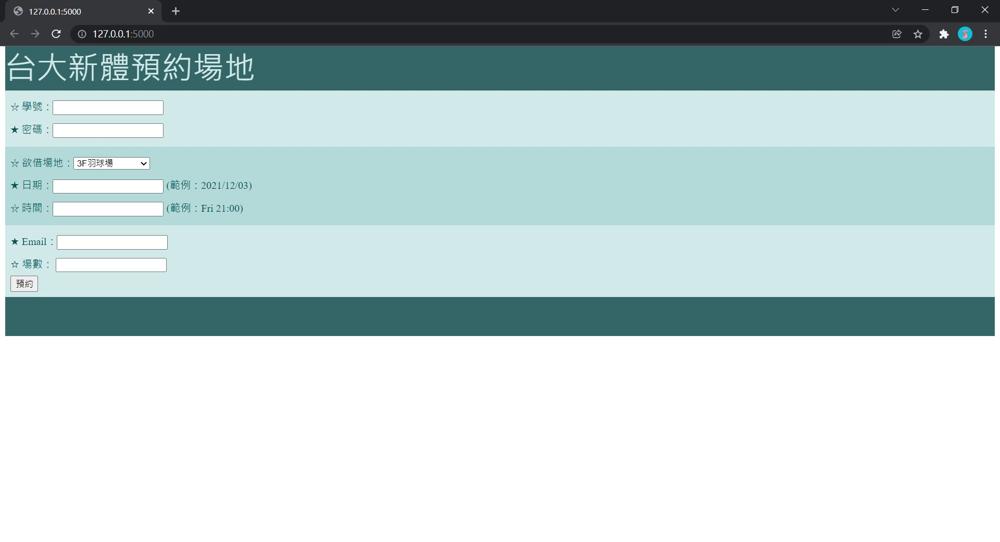

# Automatic Order System for NTU Sports Center

Lease courts in NTU Sports Center in advanced
## Preparation
+ You need to edit `for_front.bat` and `for_back.bat`, changing the path of anaconda prompt into <u><anaconda_dir>\\Scripts\\activate.bat</u>
+ Check whether the `chromedriver.exe` is suitable for your operating system. If not, it is better to download the one that works with your OS from <https://chromedriver.chromium.org/>
## Usage
First of all, you have to go to [臺大綜合體育館](https://ntupesc.ntu.edu.tw/facilities/) to check whether the court you are going to order is available. If you want to order the court in this week, you also have to make sure the remaining number is larger or same as the number you are going to order.

After making sure the court is available, you can click `main.bat` to start. You will see two cmd windows opened, and then there should be a page like the following picture appearing.

 
After you finish the form and click the `預約` button, the only thing you have to do is to wait.
## Acknowledgments
The accuracy of the CNN model we trained is about 0.906, so you will fail to order the court by using it sometimes.
